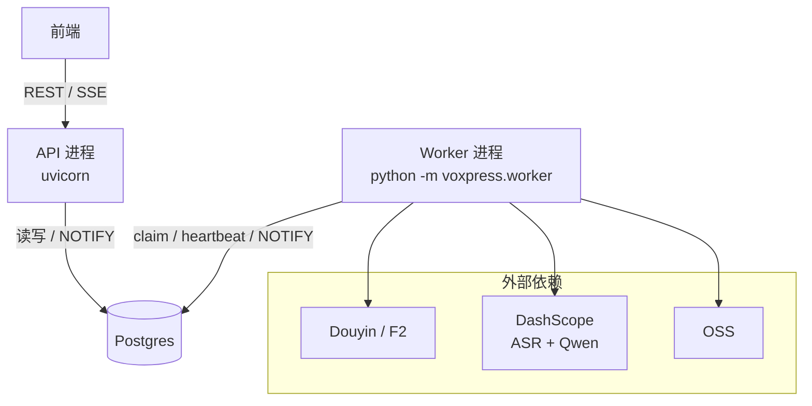
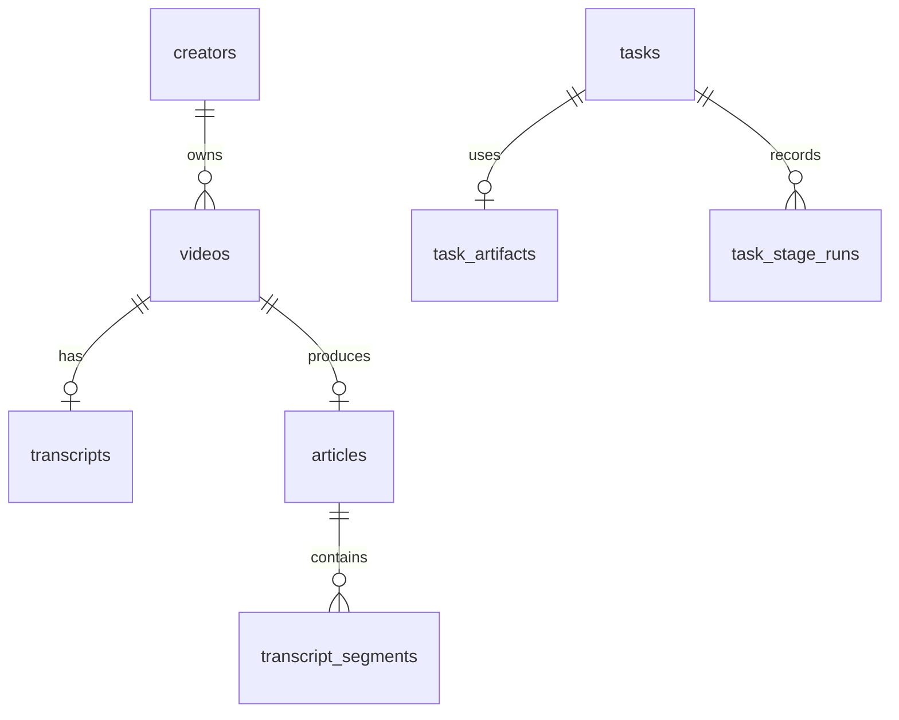
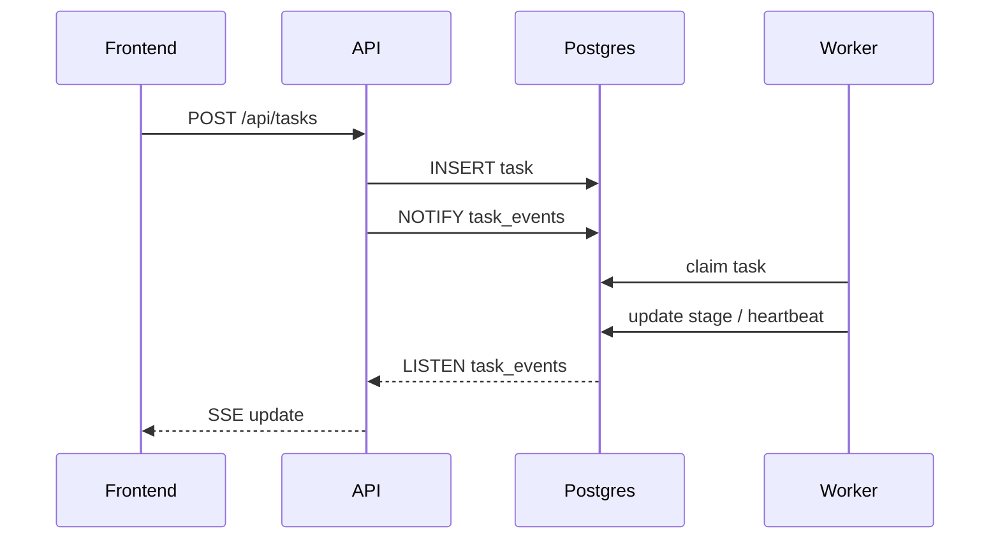

# VoxPress 架构可视化

基于当前 DashScope + OSS 实现整理的简化图示。

## 1. 进程拓扑

```mermaid
flowchart TB
    FE["前端"]
    API["API 进程<br/>uvicorn"]
    Worker["Worker 进程<br/>python -m voxpress.worker"]
    PG[("Postgres")]

    subgraph Ext["外部依赖"]
        Douyin["Douyin / F2"]
        DashScope["DashScope<br/>ASR + Qwen"]
        OSS["OSS"]
    end

    FE -- REST / SSE --> API
    API -- 读写 / NOTIFY --> PG
    Worker -- claim / heartbeat / NOTIFY --> PG
    Worker --> Douyin
    Worker --> DashScope
    Worker --> OSS
```

## 2. 任务阶段

```mermaid
flowchart LR
    Q["queued"] --> D["download"]
    D --> T["transcribe"]
    T --> C["correct"]
    C --> O["organize"]
    O --> S["save"]
    S --> Done["done"]
```

## 3. 数据关系

```mermaid
erDiagram
    creators ||--o{ videos : owns
    videos ||--o| transcripts : has
    videos ||--o| articles : produces
    articles ||--o{ transcript_segments : contains
    tasks ||--o| task_artifacts : uses
    tasks ||--o{ task_stage_runs : records
```

## 4. 实时更新

```mermaid
sequenceDiagram
    participant FE as Frontend
    participant API as API
    participant PG as Postgres
    participant W as Worker

    FE->>API: POST /api/tasks
    API->>PG: INSERT task
    API->>PG: NOTIFY task_events
    W->>PG: claim task
    W->>PG: update stage / heartbeat
    PG-->>API: LISTEN task_events
    API-->>FE: SSE update
```
