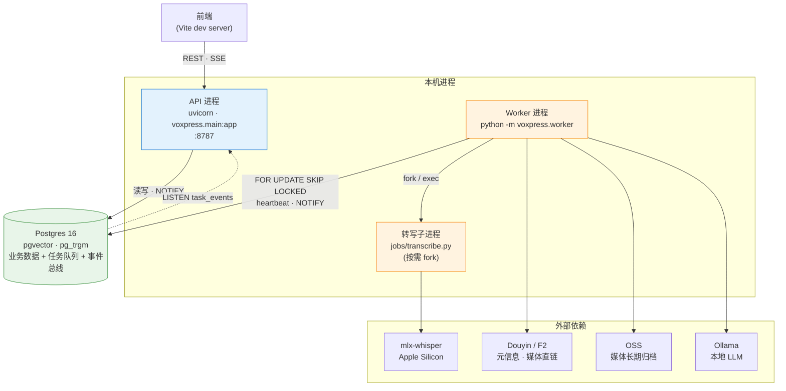
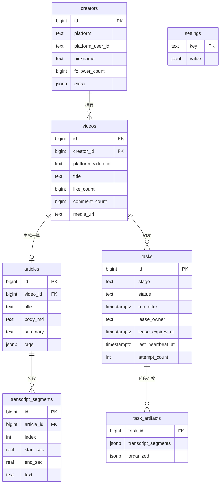
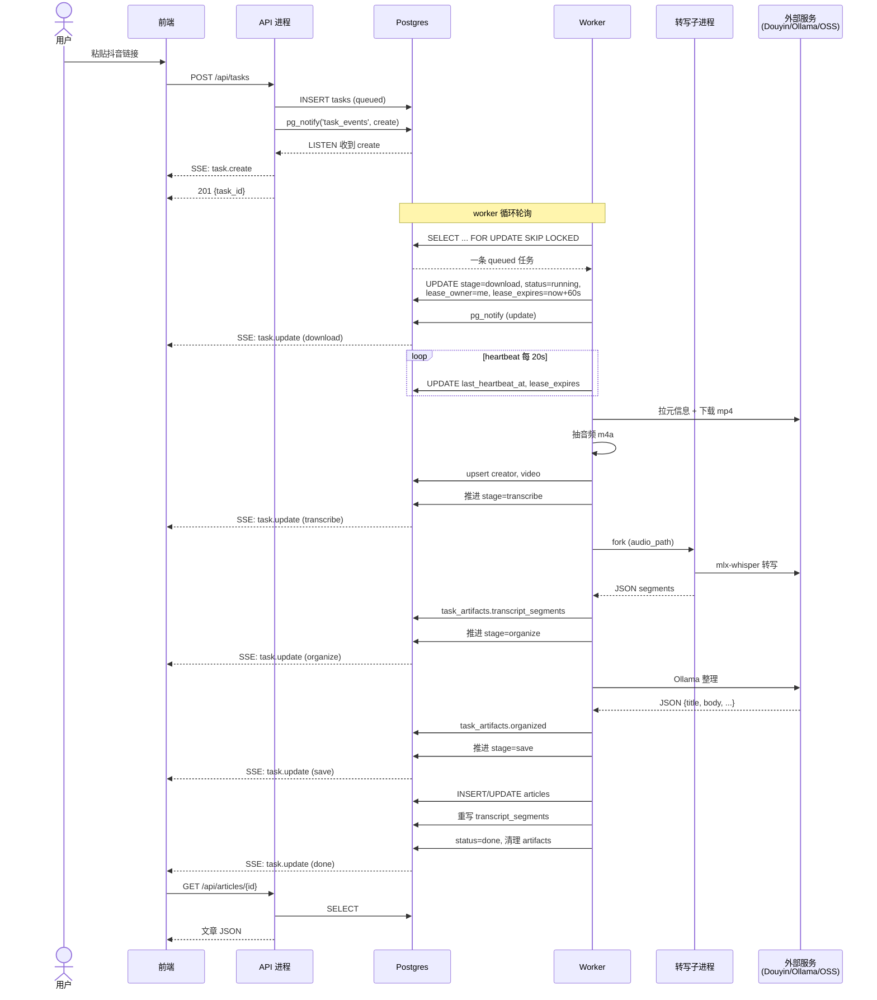
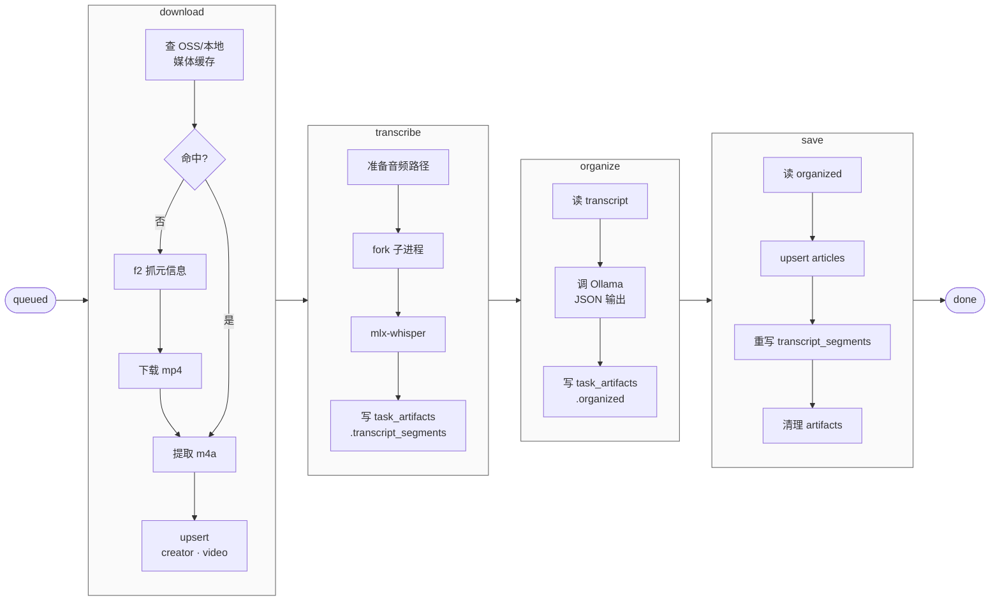
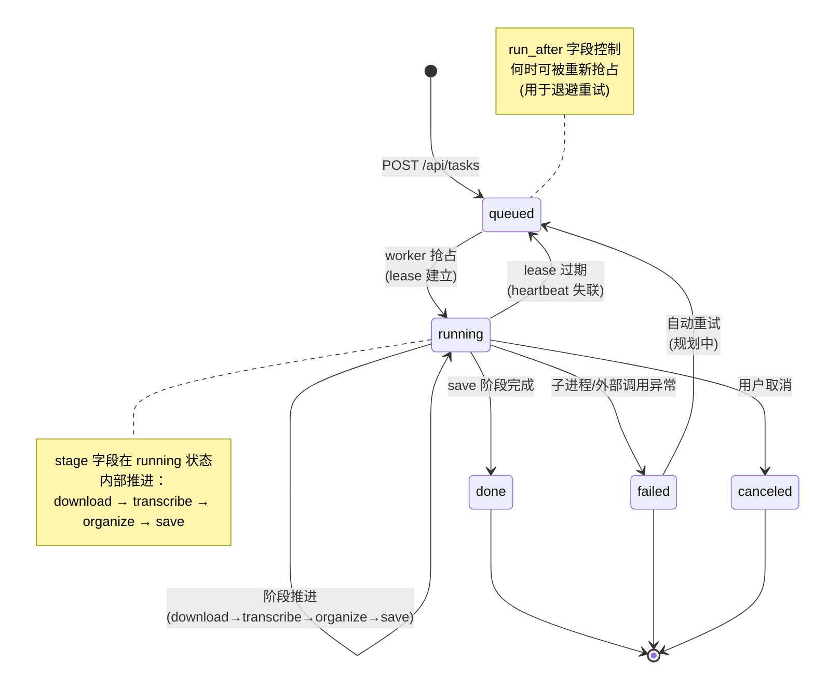
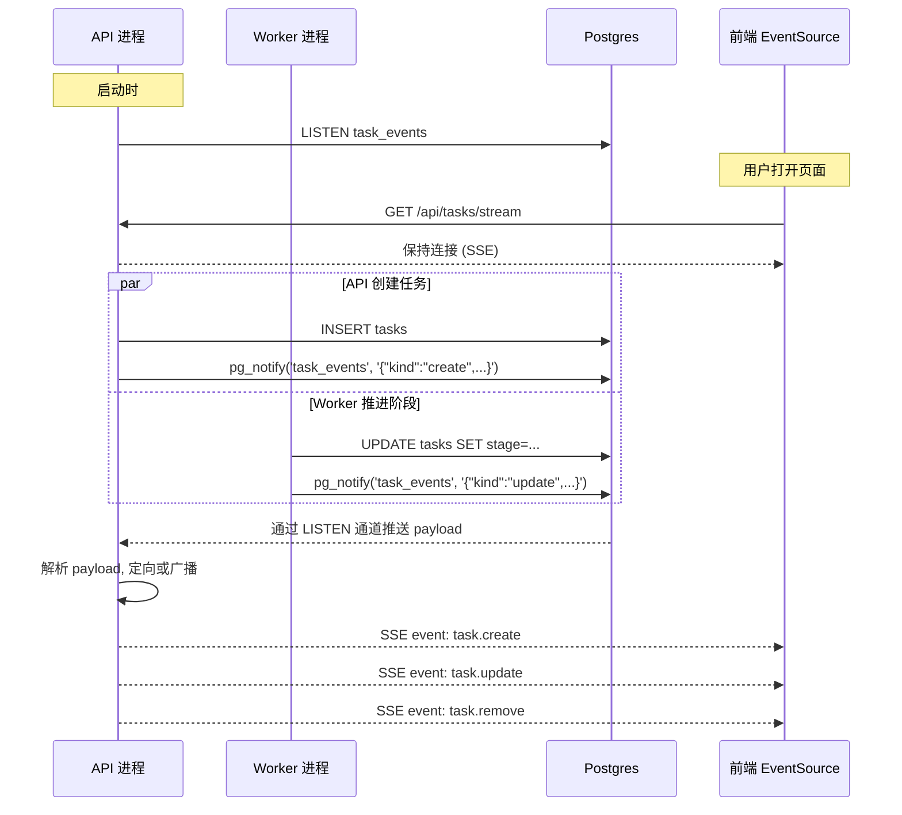
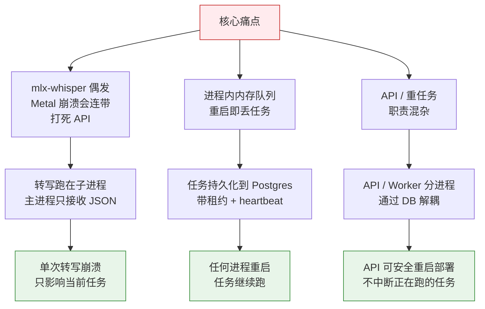

# VoxPress 架构可视化

基于 [ARCHITECTURE.md](./ARCHITECTURE.md) 的可视化补充。用 Mermaid 覆盖以下六个视角：

1. [进程拓扑与外部依赖](#一进程拓扑与外部依赖)
2. [数据模型关系](#二数据模型关系)
3. [任务端到端生命周期（时序图）](#三任务端到端生命周期时序图)
4. [Pipeline 四阶段内部流程](#四pipeline-四阶段内部流程)
5. [任务状态机](#五任务状态机)
6. [SSE 事件流：从 pg_notify 到浏览器](#六sse-事件流从-pg_notify-到浏览器)

> GitHub / VS Code Markdown 预览原生支持 Mermaid 渲染。本地用 `Obsidian`、`Typora` 也可直接查看。

---

## 一、进程拓扑与外部依赖

展示"谁和谁说话、谁拉起谁"。核心观察是 **API / Worker 完全解耦，只通过 Postgres 通信**。

**拓扑要点**

| 角色 | 责任 | 崩溃影响 |
|---|---|---|
| API 进程 | REST + SSE + 写任务记录，**不执行 pipeline** | 前端掉线；任务仍在 DB 里，worker 不受影响 |
| Worker 进程 | 抢任务、执行四阶段、维持租约 | 任务 lease 超时后被其他 worker 续上；API 正常 |
| 转写子进程 | 每次任务启动一个、跑 mlx-whisper、JSON 输出 | 只杀自己；worker 主进程收到非零退出码后标记阶段失败 |
| Postgres | 业务库 + 任务队列 + 事件总线（NOTIFY/LISTEN）| 整个系统停摆——这是唯一的单点 |

---

## 二、数据模型关系

展示业务主表与任务相关表的连接方式。任务与业务数据通过 `video_id` / `creator_id` 绑定，中间产物挂在 `task_artifacts`。

**为什么这么分**

- `task_artifacts` 把"中间产物"（逐字稿 JSON、整理后 JSON）从业务主表里剥离，这样**重跑任务不会污染已发布的文章**——`save` 成功才把最终结果写进 `articles` / `transcript_segments`。
- `tasks` 的租约字段（`lease_owner / lease_expires_at / last_heartbeat_at / attempt_count`）是整个可靠性机制的关键，单独组合成一块租约子模块。

---

## 三、任务端到端生命周期（时序图）

从"粘贴链接"到"文章可读"的完整链路。注意 **API 和 Worker 从来不直接通信**，全程靠 Postgres 转发。

**关键观察**

- **heartbeat 循环**在任务全程持续，一旦 worker 崩溃或断网，lease 会超时，其他 worker 在下一轮轮询时重新抢占——这是自愈机制。
- 每次阶段推进都有一次 `pg_notify` + 一次 SSE 推送，前端进度条跟实际阶段严格同步。
- **API 从头到尾没执行任何 pipeline 代码**，也没跟 Worker 直接建连接。

---

## 四、Pipeline 四阶段内部流程

每个阶段的职责、输入、输出、外部依赖。

**阶段并发策略**（来自 [voxpress/config.py](./voxpress/config.py)）

| 阶段 | 默认并发 | 原因 |
|---|---|---|
| download | 4 | 网络 IO 密集，可并行 |
| **transcribe** | **1** | mlx-whisper 并发会触发 Metal 断言崩溃 |
| organize | 2 | 读设置里的 `llm.concurrency` 动态收敛 |
| save | 4 | 轻量 DB 写入 |

---

## 五、任务状态机

**状态转移规则**

- `queued → running`：基于 `FOR UPDATE SKIP LOCKED + run_after <= now()`，天然避免多 worker 抢同一条。
- `running → queued`：当 `lease_expires_at < now()`（heartbeat 超过阈值未续约），其他 worker 可直接重新 SKIP LOCKED 抢占，原持有者任何后续写入都会因 lease_owner 不匹配而失败。
- `failed → queued`：目前是手动重建任务；ARCHITECTURE.md §10.2 列为待办。

---

## 六、SSE 事件流：从 pg_notify 到浏览器

新架构里 **SSE 不再依赖 API 进程内的 asyncio.Queue**，而是基于 Postgres 的 `LISTEN/NOTIFY`。这让 API 和 Worker 两个进程都能作为事件发布方，前端只订阅一次。

**三类事件**

| 事件 | 触发时机 | 前端行为 |
|---|---|---|
| `task.create` | 新任务入库 | 列表里插入一行 |
| `task.update` | 阶段推进、状态变化、心跳 | 更新进度条、状态标签 |
| `task.remove` | 任务被清理 | 从列表移除 |

**为什么不用内存 Queue**

- 多进程广播：API 用 gunicorn 或多 worker 启动时，内存 Queue 就跨不了进程
- 外部写入：未来定时任务、CLI 工具、甚至 SQL 脚本改任务，都能统一触发 SSE
- 重启恢复：API 重启不会丢事件通道，只要重新 LISTEN 就继续工作

---

## 七、一张图看懂"为什么这样设计"

把 ARCHITECTURE.md §1 的"核心设计目标"画成决策路径：

---

## 附：图例索引

| 图编号 | 类型 | 回答什么问题 |
|---|---|---|
| 图一 | flowchart | 有哪些进程 / 跟谁说话 |
| 图二 | ER | 数据怎么组织 |
| 图三 | sequence | 一条任务的完整命运 |
| 图四 | flowchart | 每个阶段内部发生什么 |
| 图五 | state | 任务可以处于哪些状态、怎么迁移 |
| 图六 | sequence | 实时事件怎么从后端传到前端 |
| 图七 | flowchart | 每个设计决策对应解决了什么问题 |

---

**文档维护**：若 ARCHITECTURE.md 中的阶段顺序、并发配置或表结构变动，同步更新对应图（图三、图四、图二）。Mermaid 源码直接写在本文件里，不引入图床。
